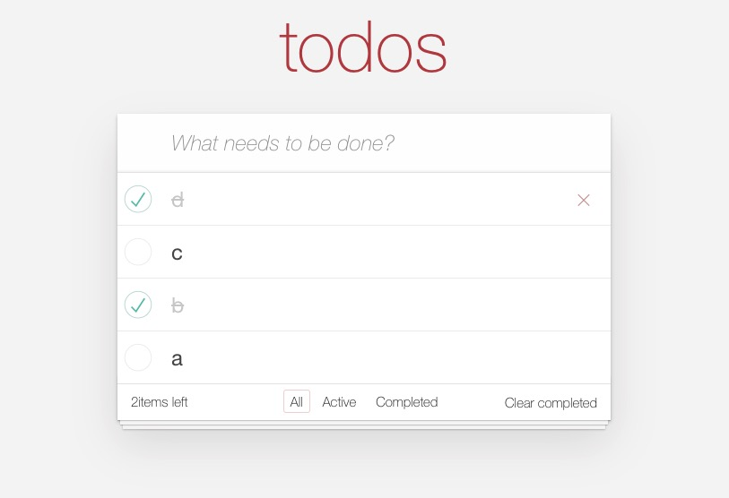

## XWebpack
XWebpack 是一个参考 Webpack 从零开始实现的 Js bundler :
* 支持 loader
* 支持 plugin
* 正确处理循环依赖

## Example
下图是用 [XReact](https://github.com/3examan/xreact) 实现的 todomvc，并且使用自己实现的 [XWebpack](https://github.com/3examan/xwebpack) 进行打包：
* todomvc 在线 Demo：https://3examan.github.io/todomvc

